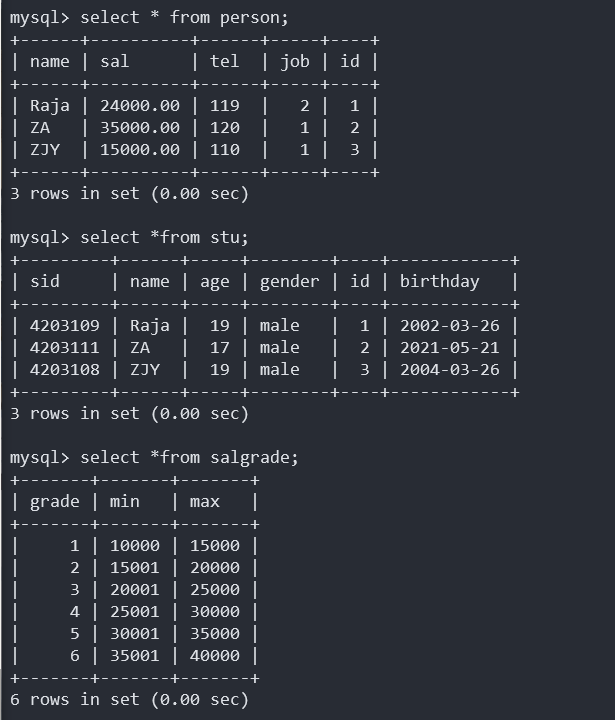

MySQL

# 课堂笔记

## sq1、 DB、DBMS和他们之间的关系?

1.  DB:DataBase (数据库，数据库实际上在硬盘上以文件的形式存在)

2.  DBMS:DataBase Management System ( 数据库管理系统，常见的有: MySQL Oracle DB2 Sybase SqlServer. . .)

3.  SQL:
    结构化查询语言，是一门标准通用的语言。标准的sql适合于所有的数据库产品。
    sQI属于高级语言。只要能看懂英语单词的，写出来的sq1语句，可以读懂什么意思。
    SQI语句在执行的时候，实际上内部也会先进行编译，然后再执行sql。( sq1语句的编译由DBMS完成。)
    DBMS负责执行sq1语句，通过执行sql 语句来操作DB当中的数据。

    DBMS - (执行)-> SQL - (操作)-> DB

## 什么是表

1.  表:table

    数据库的基本组成单元,所有的数据都以表格形式组织,目的:可读性强

2.  行:数据/记录(data)

    列:字段(column)

3.  每个字段应该包括的属性

    字段名,数据类型,相关约束

## SQL语句分类

1、DQL:数据查询语⾔:
查询语句句的关键字是：**SELECT**。
DQL其它常⽤用的保留留字有：WHERE、ORDER BY、GROUP BY和
HAVING。这些DQL保留留字常与其他类型的SQL语句句一起使⽤。

2、DML:数据操作语⾔言:
关键字是：**INSERT、UPDATE**和**DELETE**。它们分别⽤用于添加，修改和删
除表中的行。

3、DDL:数据定义语⾔:
关键字包括：**CREATE、DROP、ALTER**，可以⽤用于创建数据库（CREATE
DATABASE） 、删除数据库（DROP DATABASE）、创建表（CREAT
TABLE）、删除表 （ DROP TABLE）以及修改表结构（ALTER TABLE）
等。

4、TPL:事务处理理语⾔:
事务主要⽤用于同时执⾏多条SQL语句的情况，事务能确保多条执⾏的SQL
语句能同时执行成功，一旦有其中任何⼀条执⾏失败，则同时都不执⾏，从
⽽保证数据一致性。当批量执⾏数据操作时，使⽤事务可以提⾼执⾏效率。
TPL语句包括开始事务（BEGIN TRANSACTION）、执⾏事务（COMMIT）
和事务回滚（ROLLBACK）。多条被执⾏的SQL语句包含在开始事务和执⾏
事务语句之间，当出现异常就执⾏事务回滚，从⽽而保证所有的SQL语句都不
执⾏。

5、DCL:数据控制语⾔:
该语句通过GRANT或REVOKE获得许可，确定单个⽤户和⽤户组对数据库
对象的访问。DBA(Database Administrator，数据库管理员)会更多使用DCL
语句。

6、CCL:指针控制语⾔言:
该类型语句，⽐如：DECLARE CURSOR，FETCH INTO和UPDATE
WHERE CURRENT⽤于对⼀个或多个表单独执行的操作。

## 导入数据

1.  登录:

    mysql -uroot -p

2.  查看数据库

    `show databases;`

3.  创建数据库

    `create database testdb;`

4.  使用数据库

    `use testdb;`

5.  查看当前数据库下的表

    `show tables;`

6.  初始化数据

    creat table 

## SQL常用命令

查看当前use的数据库:`select database();`

查询数据库版本: `select version();`

结束一条语句: `\c`

退出mysql : `exit`

## 查看建表语句

查看建表语句:`show create table <table name>;`

查看其他库中的表:`show tables from <database name>;`,例如:`show tables from text;`

## 查询语句

`select 字段1,字段2,字段3... from 表名;`

### 给查询结果的列重命名:

`select 字段1,字段2 as 别名 from 表名`

注意:`as`关键字可以省略

### 标准SQL语句要求字符串使用单引号

## 条件查询

格式:

```sql
select
	字段1,字段2...
from
	表名
where
	条件;
```

more

```sql
mysql> select
    -> name,age
    -> from
    -> stu
    -> where
    -> id between 2 and 3;#闭区间相当于 2<=id<=3,字符方面左闭右开
```

而且字段可以参与数学运算

```sql
mysql> select name,salary*2 from person;
+------+-----------+
| name | salary*2  |
+------+-----------+
| Raja | 100000.00 |
| Ww   |  60000.00 |
+------+-----------+
```

in:

```sql
mysql> select
    -> name,age,salary
    -> from
    -> person
    -> where
    -> age in (18,19);
+------+------+----------+
| name | age  | salary   |
+------+------+----------+
| Raja |   19 | 50000.00 |
| Ww   |   19 | 30000.00 |
+------+------+----------+
```

like:(模糊查询 '%'任意多个字符,'__'任意一个字符_)

```sql
mysql> select
    -> name,age
    -> from
    -> person
    -> where
    -> name like '_a%';
+------+------+
| name | age  |
+------+------+
| Raja |   19 |
+------+------+
```

## 排序

order by 默认升序

```sql
mysql> select
    -> name,age,salary
    -> from
    -> person
    -> order by
    -> salary;
+------+------+----------+
| name | age  | salary   |
+------+------+----------+
| Ww   |   19 | 30000.00 |
| Raja |   19 | 50000.00 |
+------+------+----------+
```

指定升序降序asc:升序,desc降序

```sql
mysql> select
    -> name,age,salary
    -> from
    -> person
    -> order by
    -> salary desc;
+------+------+----------+
| name | age  | salary   |
+------+------+----------+
| Raja |   19 | 50000.00 |
| Ww   |   19 | 30000.00 |
+------+------+----------+
```

多重排序:越靠前的条件越能主导

```sql
mysql> select
    -> name,age,sal
    -> from
    -> person
    -> order by
    -> age asc,sal desc;#age升序,age相同时按sal降序排
+------+------+----------+
| name | age  | sal      |
+------+------+----------+
| ZA   |   17 | 40000.00 |
| Raja |   19 | 50000.00 |
| Ww   |   19 | 30000.00 |
+------+------+----------+

mysql> select 	#2
    -> name,age,sal
    -> from		#1
    -> person
    -> where 	#3
    -> age=19
    -> order by #4
    -> sal desc;
+------+------+----------+
| name | age  | sal      |
+------+------+----------+
| Raja |   19 | 50000.00 |
| Ww   |   19 | 30000.00 |
+------+------+----------+
```


按照查询字段的顺序排序:

```sql
mysql> select
    -> name,age,sal
    -> from
    -> person
    -> order by
    -> 2 asc,3 desc;
+------+------+----------+
| name | age  | sal      |
+------+------+----------+
| ZA   |   17 | 40000.00 |
| Raja |   19 | 50000.00 |
| Ww   |   19 | 30000.00 |
+------+------+----------+
```

## 分组函数

注意:注意分组函数不可以直接出现在where语句中,因为where之后才可以分组

count 计数

sum 求和

avg 平均值

max 最大值

min 最小值

注意:

1.  对某一组数据进行操作

2.  分组函数自动忽略null,而且数据只要有null参与的运算结果一定为null

    1.  `ifnull(comm,0) 空处理函数`将对null进行预处理--单行处理

        ```sql
        mysql> select
            -> count(ifnull(sal,0))
            -> from
            -> person;
        +----------------------+
        | count(ifnull(sal,0)) |
        +----------------------+
        |                    3 |
        +----------------------+
        #
        mysql> select name,ifnull(sal,0) yearsal from person;
        +------+----------+
        | name | yearsal  |
        +------+----------+
        | Raja | 50000.00 |
        | Ww   | 30000.00 |
        | ZA   |     0.00 |
        +------+----------+
        
        mysql> select sum(ifnull(sal,0)) yearsal from person;
        +----------+
        | yearsal  |
        +----------+
        | 80000.00 |
        +----------+
        ```

3.  嵌套查询

    ```sql
    mysql> select name,age,sal from person where sal < (select avg(sal) from person);#select嵌套
    +------+------+----------+
    | name | age  | sal      |
    +------+------+----------+
    | Ww   |   19 | 30000.00 |
    +------+------+----------+
    ```

    

## 分组查询

注意:

1.  分组函数一般和grop by使用
2.  grop by 在where之后执行
3.  没有grop by 会默认自成一组
4.  **当一条语句后面有group by时,select后面只能跟参加分组的字段和分组函数**

group by :按照某个字段或者某些字段进行分组。
having :having是对分组之后的数据进行再次过滤。

```sql
mysql> select #3
	   age,max(sal)
	   from #1 
	   person 
	   group by#2 
	   age;
+------+----------+
| age  | max(sal) |
+------+----------+
|   17 |     NULL |
|   19 | 50000.00 |
+------+----------+
```

## 多字段联合分组查询

```sql
mysql> select age,job,max(sal) from person group by
age,job;
+------+-----+----------+
| age  | job | max(sal) |
+------+-----+----------+
|   17 |   1 | 35000.00 |
|   17 |   2 | 40000.00 |
|   19 |   1 | 30000.00 |
|   19 |   2 | 50000.00 |
+------+-----+----------+
```

## having和where

```sql
mysql> select max(sal),job from person group by job having max(sal)>35000;

mysql> select max(sal),job from person where sal > 35000 group by job;

##这里使用where更好
```

having在分组之后过滤,where在分组之前过滤

## 查询结果去重

关键字:`distinct`

```sql
mysql> select distinct age from person;
+------+
| age  |
+------+
|   19 |
|   17 |
+------+
```


```sql
mysql> select count(distinct age) from person;#先去重再查询
+---------------------+
| count(distinct age) |
+---------------------+
|                   2 |
+---------------------+
```


注意: `distinct`出现在所有字段的最前面--表示所有字段合起来去重

## 连接查询

### 分类:根据表的连接方式

1.  内连接,inner--两张表没有主次
    1.  等值连接--等量关系
    2.  非等值连接
    3.  自连接
2.  外连接,outer--一张主表,一张右表
    1.  左外连接
    2.  右外连接
    3.  特点:主表数据无条件查询出来
3.  全连接(很少)

### 笛卡尔乘积现象

两张表连接查询,如果不加条件,则条数是两张表的数据条数乘积


### 表的别名

```sql
mysql> select p.name,s.name from person p,stu s;
+------+------+
| name | name |
+------+------+
| Raja | Raja |
| Raja | ZA   |
| Raja | ZJY  |
| Ww   | Raja |
| Ww   | ZA   |
| Ww   | ZJY  |
| ZA   | Raja |
| ZA   | ZA   |
| ZA   | ZJY  |
| DP   | Raja |
| DP   | ZA   |
| DP   | ZJY  |
+------+------+
```

这样的好处就是执行效率高,可读性高,而且不会出错(因为查找是在多个表中找,字段名相同会出错)

### 避免笛卡尔积现象--加条件

注意:不会改变匹配次数

```sql
mysql> select
    -> p.name,p.sal,s.gender
    -> from
    -> person p,stu s
    -> where
    -> p.id = s.id;	#SQL92语法
+------+----------+--------+
| name | sal      | gender |
+------+----------+--------+
| Raja | 50000.00 | male   |
| ZA   | 30000.00 | male   |
| ZJY  | 35000.00 | male   |
+------+----------+--------+
```

### inner之等值连接:最大特点,连接条件是等值关系

```sql
SQL92:
mysql> select
    -> p.name,s.gender
    -> from
    -> person p,stu s;
    -> where
    -> p.id = s.id
```

```sql
SQL99
mysql> select
    -> p.name,s.gender
    -> from			#表连接语法
    -> person p
    -> join			#表连接语法
    -> stu s
    -> on			#连接条件
    -> p.id = s.id	#内连接中的等值连接
    -> where		#筛选条件
    -> p.sal>20000;
#结构更加清晰
```

inner标识:表名这是一个内连接-可读性高

```sql
mysql> select
    -> p.name,s.gender
    -> from
    -> person p
    -> inner join #内连接标志
    -> stu s
    -> on
    -> p.id = s.id
    -> where
    -> p.sal>20000;
+------+--------+
| name | gender |
+------+--------+
| Raja | male   |
| ZA   | male   |
| ZJY  | male   |
+------+--------+
```

### inner之非等值连接--连接条件是非等值关系



```sql
#根据工资显示等级
mysql> select p.name,p.sal,sal.grade
    -> from person p
    -> inner join salgrade sal
    -> on p.sal between sal.min and sal.max;
+------+----------+-------+
| name | sal      | grade |
+------+----------+-------+
| ZJY  | 15000.00 |     1 |
| Raja | 24000.00 |     3 |
| ZA   | 35000.00 |     5 |
+------+----------+-------+
```

### inner之自连接--一张表看成两张表

```sql
SELECT
	a.`name` aname,
	b.`name` bname 
FROM
	infor a
	INNER JOIN infor b ON a.`leaderid` = b.`id`;
	
```


### 外连接

因为内连接可能会丢失数据(数据无法匹配则会丢失数据)


这时候使用外连接即可


### 多表联合查询--还是看成两张表


## 嵌套子查询

select语句嵌套子select


1.  where后嵌套子查询

    ```sql
    SELECT
    	s.`name`,
    	s.sal 
    FROM
    	person s 
    WHERE
    	s.sal >= ( SELECT AVG( p.sal ) FROM person p );
    //因为分组函数不能在where中使用
    ```

2.  from后嵌套子查询

    ```sql
    # 查询每个部门平均薪水的等级
    SELECT
    	t.myjob,
    	t.avgsal,
    	s.grade 
    FROM
    	( SELECT job myjob, AVG( sal ) avgsal FROM person GROUP BY job ) t #注意查询出来的临时表要起别名
    	LEFT JOIN salgrade s ON avgsal BETWEEN s.min 
    	AND s.max;
    ```

    

    ```sql
    # 查询每个部门平均的薪水等级
    SELECT
    	t.job,
    	AVG( t.grade ) 
    FROM
    	( SELECT job, grade FROM person INNER JOIN salgrade ON sal BETWEEN min AND max ) t 
    GROUP BY
    	t.job
    ```

    ```sql
    #查询每个部门平均的薪水等级 (不用临时表)
    SELECT
    	p.job,
    	AVG( s.grade ) 
    FROM
    	person p
    	LEFT JOIN salgrade s ON p.sal BETWEEN s.min 
    	AND s.max 
    GROUP BY
    	p.job
    ```

3.  在select后面嵌套子查询

    ```sql
    # 不同员工所在的部门名称 (非嵌套)
    SELECT
    	p.`name` '员工',
    	i.`name` '部门' 
    FROM
    	person p
    	INNER JOIN infor i ON p.job = i.id
    ```

    

    ```sql
    # 嵌套
    SELECT p.`name`,( SELECT i.`name` FROM infor i WHERE p.job = i.id ) `name` 
    FROM
    	person p
    ```

    

## union(可以将查询结果集相加)

特点:可以将不相关的表的结果相拼接,但列数必须相同

```sql
SELECT
	p.`name` 
FROM
	person p UNION
SELECT
	i.`name` 
FROM
	infor i
```


## limit(分页查询MySQL特有)

1.  作用:取结果集中的部分数据

2.  机制:`limit  startIndex length`

    startIndex:起始位置

    length:取几个

    ```sql
    # 取前5个数据
    SELECT
    	`name`,
    	sal 
    FROM
    	person 
    ORDER BY
    	sal DESC 
    	LIMIT 0,3 #也可以写成limit 3,默认从0开始
    ```

    

3.  limit是最后一个执行的

4.  通用的标准分页sql

    每页显示pageSize条记录
    $$
    F(pageNo) = (pageNo-1)*pageSIze
    $$
    则第pageNo页显示F(pageNo)条记录

## 建表 CREATE TABLE

```sql
create table 表名(
    字段1 数据类型,
    字段2 数据类型,
    ...
);
#举例:
CREATE TABLE tbl_raja (
	`name` VARCHAR ( 15 ),
	age INT ( 3 ),
	sal DECIMAL ( 10, 2 )
);
#注意:default 可以规定字段默认值
```


varchar 动态长度

char 定长

表名以t_或者tbl__开头

## 插入数据 INSERT INTO

1.  基本语法

```sql
insert into 表名
(字段1,字段2,...)
values
(数据1,数据2,...)
# 举例:
INSERT INTO tbl_raja ( `name`, age, sal )
VALUES
	( 'raja', 19, 1234.22 );
# 如果有没写完,自动补为NULL
```

2.  简写形式

```sql
#另一种简略写法
INSERT INTO 表名 VALUES( 对应数据值... );
#注意 简写的数据必须对应字段,而且不能缺少数据
#举例:
INSERT INTO tbl_raja
VALUES
	( 'ZA', 17, 12345 );
```

3.  一次插入多行数据

    ```sql
    INSERT INTO 表名 (字段1,字段2,...)
    VALUES
    	(数据...),
    	(数据...),
    	...
    	);
    #举例
    INSERT INTO tbl_raja ( `name`, age, sal )
    VALUES
    	( 'lisi', 19, 2222 ),
    	( 'wangmazi', 20, 2345 );
    ```

## 表的复制与批量插入

1.  基本语法

    ```sql
    CREATE TABLE 新表名 AS SELECT * FROM 需要复制的表名;
    # 将查询结果当做一张新表创建
    #举例
    CREATE TABLE tb_copy AS SELECT
    * 
    FROM
    	tbl_raja;
    ```

2.  将查询结果插入到一张表中

    ```sql
    # 举例
    INSERT INTO tbl_raja SELECT `name`,age,sal FROM stu;
    # 注意:查询结果和被插入的表的字段数应该一样
    ```

## 修改数据 UPDATE

1.  语法 

    ```sql
    UPDATE 表名
    SET ... = ...,
    WHERE
    	条件;
    # 举例:
    UPDATE person 
    SET sal = 26000 
    WHERE
    	`name` = 'Raja';
    ```

## 删除数据 DELETE FROM

1.  语法格式:

    ```sql
    DELETE FROM 表名
    WHERE
    	条件
    # 举例
    DELETE
    FROM
    	tbl_raja 
    WHERE
    	`name` = 'wangmazi'
    ```

2.  完全删除数据

    ```sql
    TRUNCATE TABLE 表名;
    # 举例:
    TRUNCATE TABLE tbl_raja;
    # 注意:只留下表的定义,不能回滚
    ```

## DDL 表结构的修改

```sql
#删除表
DROP TABLE 表名
#或者
DROP TABLE IF EXISTS 表名 
#修改表名
ALTER TABLE 原表名 RENAME 新表名;
#增加表字段（表中增加新列）
ALTER TABLE 表名 ADD 字段名 数据类型;
#删除表字段
ALTER TABLE 表名 DROP 字段名;
#修改表字段类型
ALTER TABLE 表名 MODIFY 字段名 新数据类型;
#修改表字段名称和类型
ALTER TABLE 表名 CHANGE 原字段名 新字段名 数据类型;

#修改表字段的顺序
在以上方法后添加 FIRST / AFTER 比较的字段名
FIRST 直接修改至最前面
AFTER 字段名 修改至此字段后面
```

CRUD增删改查

## 约束


1.  非空约束 `NOT NULL`

    特点:非空

    ```sql
    # 建表时约束
    CREATE TABLE newtbl ( nname VARCHAR ( 10 ) NOT NULL );
    #修改表结构时添加约束
    MODIFY ADD CHANGE 后都可以添加
    ```

    注意:非空约束没有表级约束,只能在一个字段后添加

2.  唯一性约束 `UNIQUE` 

    特点:唯一,但可以为NULL

    ```sql
    #建表时约束
    CREATE TABLE newtbl ( nname VARCHAR ( 10 ) UNIQUE );
    #NOT NULL
    ```

    一个字段后添加约束:列级约束

    注:可以将多列联合添加`UNIQUE`,多个字段不能同时相同

    ```sql
    CREATE TABLE testybl(
    	id int,
    	usercode int,
    	username VARCHAR(20),
    	UNIQUE(usercode,username) #联合约束
    );
    ```

    多个字段联合起来添加一个约束:表级约束

3.  主键约束 primary key

    特点:唯一非空,**而且一张表只能有一个主键**

    ```sql
    # 建表时约束
    CREATE TABLE testtbl (
        NAME VARCHAR ( 20 ),
        id INT PRIMARY KEY #主键约束
    );
    ```

    注意:

    1.  主键约束: primary key
    2.  主键字段: 施加主键约束的字段
    3.  主键值: 向主键字段中插入的值

    主键作用:

    1.  表的设计三范式

        任何一张表都应该有主键

    2.  一张表中记录的唯一标识

    主键分类:

    1.  主键的字段数量
        1.  单一主键(推荐)
        2.  复合主键:多个字段联合添加一个主键约束
    2.  主键的性质
        1.  自然主键:主键和业务无关(推荐)
        2.  业务主键:主键值和业务相关,银行卡号,身份证号...

4.  主键自增AUTO_INCREMENT

    特点:自动增加,从1开始

    在 定义主键后面添加auto_increment:

    `primary key auto_increment`

    