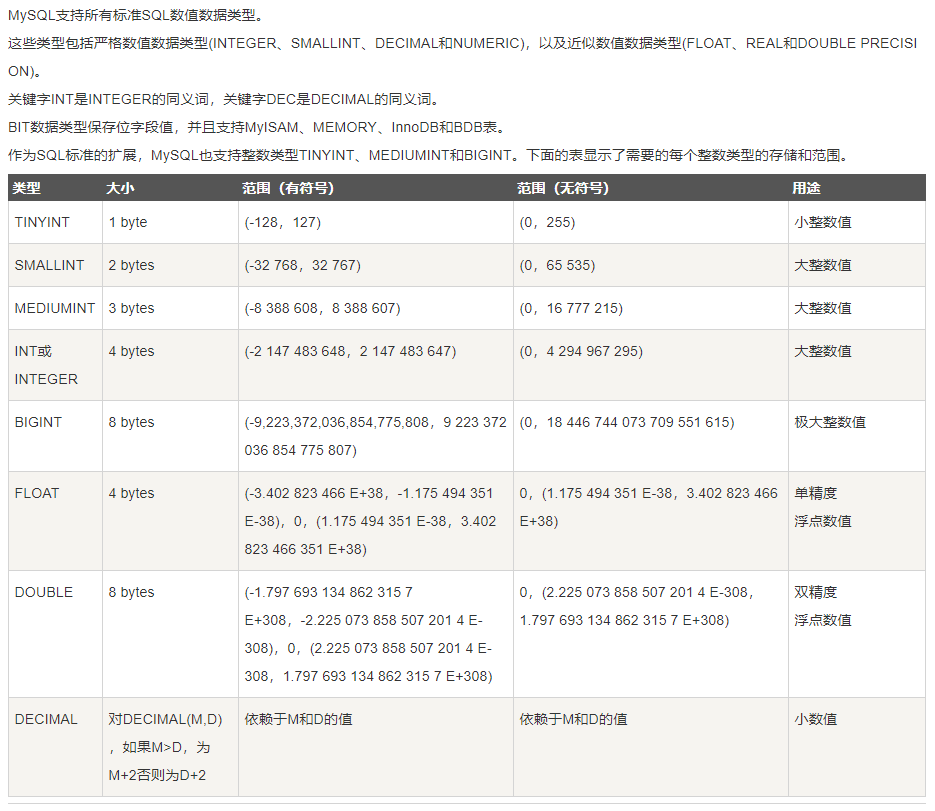
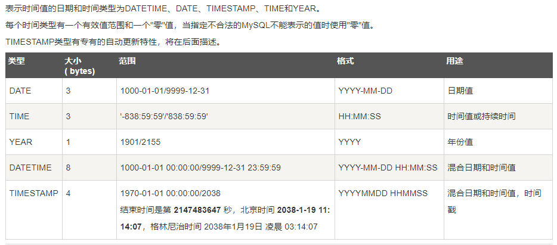
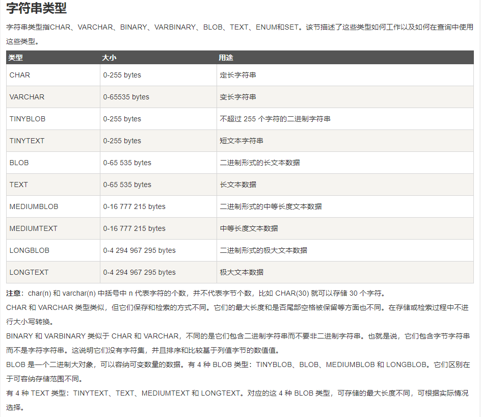
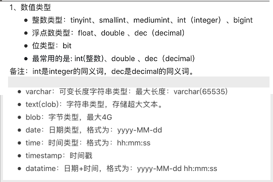
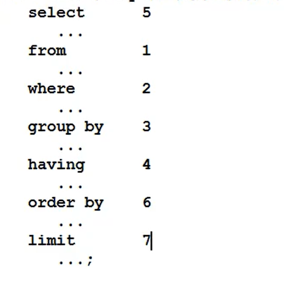
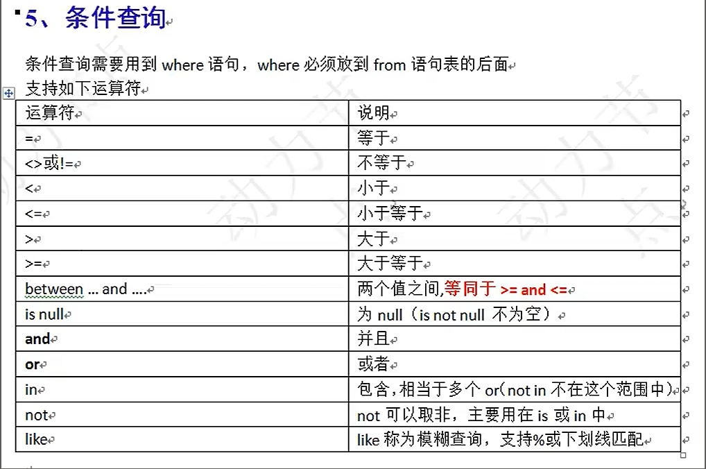
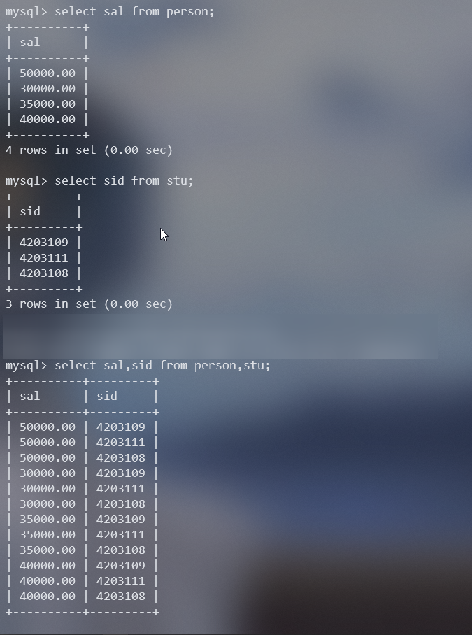
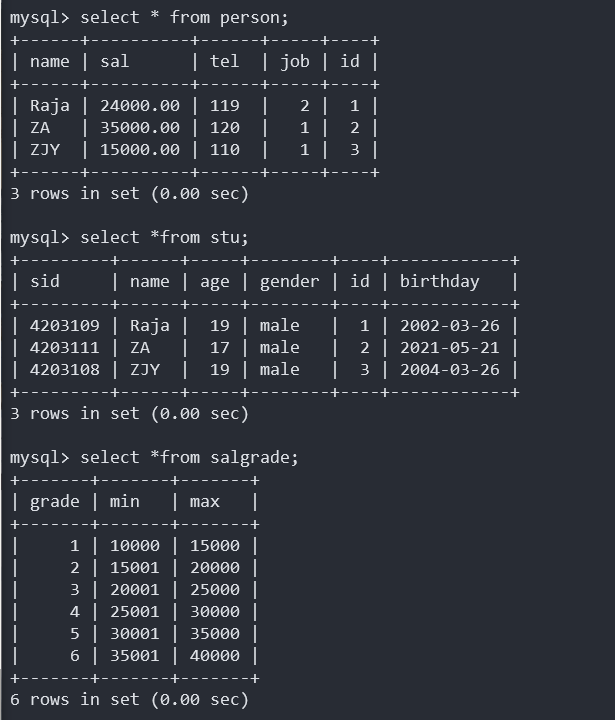
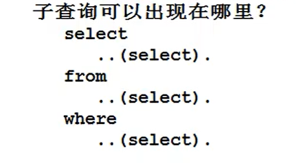

# MySQL基本操作总结

## 数据库(Database)

1.  定义:按照数据结构来组织,存储和管理数据的仓库(通常是一个文件或者一组文件)

2.  作用:高效地保存,读写数据

3.  分类(关系型和非关系型)

    1.  关系型

        Oracle、MySQL、SQLServer、Access、DB2等

    2.  非关系型

        键值存储型数据库：Redis
        文档存储型数据库：MongoDB、CouchDB
        列表存储型数据库：HBase
        图数据库：FlockDB

4.  概念:

    1.  DB:数据库(Database)

        数据库通常使用数据表组成,数据表由字段和其数据等组成

    2.  DBMS:数据库管理系统(datebase mangement systerm)

        例如MySQL,Oracle等

    3.  SQL:
        结构化查询语言，是一门标准通用的语言。标准的sql适合于所有的数据库产品。
        sql属于高级语言。
        SQI语句在执行的时候，实际上内部也会先进行编译，然后再执行sql。( sq1语句的编译由DBMS完成。)
        DBMS负责执行sq1语句，通过执行sql 语句来操作DB当中的数据。

        执行顺序:SQL->DBMS(执行)->DB

5.  关系型数据库常用术语

    1.  数据库表 table:

        表是数据库存储数据的基本单位,数据库正是一些相互关联的表的集合

    2.  列 coulumn:

        列也称为字段,将具有相同属性的数据放在同一列

    3.  行 row:

        行也称为记录,是一组相关的**数据**

    4.  主键 primary key

        1.  每个表中绝对唯一的字段是该表的主键
        2.  一个数据表中只有一个主键
        3.  主键的数据非空唯一
        4.  习惯:
            1.  不更新主键列值
            2.  不重用主键列值
            3.  不在主键列中使用可能更改的值

6.  数据库范式:

    为建立冗余小,结构合理的数据库,需要遵循一些规则

    1.  第一范式(1NF)(确保每列保持原子性)

        **数据库表中的所有字段值都是不可分解的原子值**

    2.  第二范式(2NF)(确保表中的每列都和主键相关)

        第二范式在第一范式的基础之上更进一层。第二范式需要确保数据库表中的每一列都和主键相关，而不能只与主键的某一部分相关(主要针对联合主键而言)。

        **也就是说在一个数据库表中，一个表中只能保存一种数据，不可以把多种数据保存在同一张数据库表中。**

    3.  第三范式(3NF)(确保每列都和主键列直接相关,而不是间接相关)

        **第三范式需要确保数据表中的每一列数据都和主键直接相关，而不能间接相关**

        

## 常用命令

1.  mysql 服务

    1.  启动与终止服务

        ```sql
        # DOS 命令窗口
        net start mysql #启动数据库
        net stop mysql	#关闭数据库
        ```

    2.  在终端处连接数据库

        ```sql
        mysql -hlocalhost -uroot -p密码
        ```

        >   1.  其中-h表示服务器名，localhost表示本地， 如果访问本地数据库，则该参数可以不写;
        >
        >   2.  -u为数据库用户名，root是mysql默认用户名;
        >
        >   3.  -p为密码，如果没有设置密码，该参数可以不写;如果设置了密码，可直接在-p后输入，比如: -p123456;
        >
        >       可以在输入-p后回车,此时可以隐秘输入密码

        注意:成功连接到MySQL后,DOS命令行提示符为`mysql>`.

2.  MySQL基本命令(不区分大小写)

    ```sql
    #基本操作
    select version();#查看数据库版本
    select now();#查看当前时间
    exit; #退出数据库
    Ctrl + c #结束一条语句
    
    #数据库基本操作
    SHOW DATABASES; #列出数据库管理系统中所有数据库列表
    USE 数据库名; #切换到要操作的数据库(之后所有的SQL指令都针对于此数据库)
    SHOW TABLES #显示指定数据库的所有表
    DESC 表名 #显示表结构(包括字段名,数据类型,约束条件等)
    SELECT * FROM 表名 #显示表中信息
    ```

## MySQL数据类型

1.  数值类型

    

    常用:`int double dec(decimal)`

2.  日期和时间类型

    

3.  字符串类型

    

    常用:`char varchar text`

    注意:标准SQL要求字符串使用单引号括起来

4.  总结常用类型

    

## SQL分类

1.  DQL 数据查询语言
2.  DML 数据操作语言
3.  DDL 数据定义语言
4.  TPL 事务处理语言
5.  DCL 数据控制语言
6.  CCL 指针控制语言

备注:

1.  重心:**DQL** DML
2.  CRUD 计算处理时的 **增加,查询,更新,删除**

### DDL 数据定义语言

包括:`创建与删除数据库,创建,删除,修改表结构`

`CREATE DROP ALTER`

#### 创建数据库 CREATE DATABASE

1.  语法

    ```sql
    CREATE DATABASE 数据库名;
    # 举例
    CREATE DATABASE mytb;
    ```

2.  注意:

    1.  数据库名不要写中文
    2.  mysql字符集为utf8
    3.  已经存在该数据库会报错

#### 删除数据库 DROP DATABASE

```sql
DROP DATABASE 数据库名;
# 举例
DROP DATABASE mytb
```

#### 创建表 CREATE TABLE

1.  语法:

    ```sql
    CREATE TABLE 表名(
        字段1 数据类型1 约束条件1,
        字段2 数据类型2 约束条件2,
        ...
    );
    # 举例
    CREATE TABLE tbl_raja (
    	`name` VARCHAR ( 15 ),
    	age INT ( 3 ),
    	sal DECIMAL ( 10, 2 )
    );
    #注意:default 可以规定字段默认值
    #常用字段名用``括起来,以标识为字段
    ```

2.  复制表(配合SELECT使用)

    ```sql
    CREATE TABLE 新表名 AS SELECT * FROM 需要复制的表名;
    # 将查询结果当做一张新表创建
    #举例
    CREATE TABLE tb_copy AS SELECT * FROM tbl_raja;
    ```

#### 删除表 DROP TABLE

语法:

```sql
DROP TABLE 表名;
# 举例
DROP TABLE tbl_raja;
```

#### 修改表结构 ALTER TABLE

`RENAME ADD DROP MODIFY CHANGE `

```sql
#修改表名
ALTER TABLE 原表名 RENAME 新表名;
#增加表字段（表中增加新列）
ALTER TABLE 表名 ADD 字段名 数据类型;
#删除表字段
ALTER TABLE 表名 DROP 字段名;
#修改表字段类型
ALTER TABLE 表名 MODIFY 字段名 新数据类型;
#修改表字段名称和类型
ALTER TABLE 表名 CHANGE 原字段名 新字段名 数据类型;

#修改表字段的顺序
在以上方法后添加 FIRST / AFTER 比较的字段名
FIRST #直接修改至最前面
AFTER 字段名 #修改至此字段后面
```

### DML 数据操作语言

包括:`插入记录 更新记录 删除记录`

#### 插入数据:`INSERT`

1.  基本语法:

    ```sql
    INSERT INTO 表名 (字段1,字段2,...)
    values
    	(数据1,数据2,...)
    # 举例:
    INSERT INTO tbl_raja ( `name`, age, sal )
    VALUES
    	( 'raja', 19, 1234.22 );
    # 如果有没插入的字段,自动补为NULL
    ```

2.  简写形式

    ```sql
    INSERT INTO 表名 VALUES( 对应数据值... );
    #注意 简写的数据必须对应字段!,而且不能缺少数据!!!
    #举例:
    INSERT INTO tbl_raja
    VALUES
    	( 'ZA', 17, 12345 );
    ```

3.  一次插入多行数据

    ```sql
    INSERT INTO 表名 (字段1,字段2,...)
    VALUES
    	(数据组1...),
    	(数据组2...),
    	...;
    #举例
    INSERT INTO tbl_raja ( `name`, age, sal )
    VALUES
    	( 'lisi', 19, 2222 ),
    	( 'wangmazi', 20, 2345 );
    ```

4.  表的批量插入(需和SELECT配合)

    将查询结果插入到另一张表中

    ```sql
    # 举例
    INSERT INTO tbl_raja SELECT `name`,age,sal FROM stu;
    # 注意:查询结果和被插入的表的字段数应该一样!!!
    ```

#### 更新记录 `UPDATE`

语法:

```sql
UPDATE 表名 SET
字段1 = 数据1,
字段2 = 数据2,
...
WHERE
	条件;
# 举例:
UPDATE person 
SET sal = 26000 
WHERE
	`name` = 'Raja';
# 不写条件全部都会改
```

#### 删除记录 `DELETE`

1.  基本语法:

    ```sql
    DELETE FROM 表名
    WHERE
    	条件
    # 举例
    DELETE
    FROM
    	tbl_raja 
    WHERE
    	`name` = 'wangmazi'
    ```

2.  完全删除数据(不能恢复,慎用!!!)

    ```SQL
    TRUNCATE TABLE 表名;
    # 举例:
    TRUNCATE TABLE tbl_raja;
    # 注意:只留下表的定义,不能回滚
    ```

    

### DQL 数据查询语言

一般格式与执行顺序



####  查询语句 `SELECT`

```sql
SELECT 字段1,字段2,字段3... FROM 表名;
```

#### 为查询结果的列重命名 `AS`

```sql
select 字段1 AS 别名1,字段2 AS 别名2,字段3 ... from 表名;
# 注意:as可以省略
```

#### 条件查询 `WHERE`



1.  格式

    ```sql
    select
    	字段名1,字段名2...
    from
    	表名
    where
    	条件;
    ```

2.  字段可以参与数学运算

    ```sql
    select name,salary * 2 from person;
    #结果
    +------+-----------+
    | name | salary*2  |
    +------+-----------+
    | Raja | 100000.00 |
    | Ww   |  60000.00 |
    +------+-----------+
    ```

3.  条件语句

    1.  between and (在... and ... 之间相当于>= <=)

        ```sql
        select
        	name,age
        from
        	stu
        where
        	id between 2 and 3;#闭区间相当于 2<=id<=3,注意:字符比较左闭右开!!!
        ```

    2.  in(在(...,...)之中 相当于多个or)

        ```sql
        select
        	name,age,salary
        from
        	person
        where
        	age in (18,19);
        #结果
        +------+------+----------+
        | name | age  | salary   |
        +------+------+----------+
        | Raja |   19 | 50000.00 |
        | Ww   |   19 | 30000.00 |
        +------+------+----------+
        ```

    3.  like (模糊查询: 注意 % 表示任意多字符 __ 表示任意一个字符)

        ```sql
        #查询第二个字符是a的name和其age
        select
        	name,age
        from
        	person
        where
        	name like '_a%';
        #结果
        +------+------+
        | name | age  |
        +------+------+
        | Raja |   19 |
        +------+------+
        #注意:想要查询带 __ 的需要转义符转义 \_ 
        ```

#### 排序 `ORDER BY`

1.  基本语法

    ```sql
    SELECT
    	字段
    FROM
    	表名
    ORDER BY
    	字段名
    	
    # 默认升序
    #举例
    select
    	name,age,salary
    from
    	person
    order by
    	salary;
    #结果
    +------+------+----------+
    | name | age  | salary   |
    +------+------+----------+
    | Ww   |   19 | 30000.00 |
    | Raja |   19 | 50000.00 |
    +------+------+----------+
    ```

2.  升序ASC 降序DESC

    ```sql
    # 在依据排序的字段后加上 ASC 或者 DESC
    select
    	name,age,salary
    from
    	person
    order by
    	salary desc;
    #结果
    +------+------+----------+
    | name | age  | salary   |
    +------+------+----------+
    | Raja |   19 | 50000.00 |
    | Ww   |   19 | 30000.00 |
    +------+------+----------+
    ```

3.  多重排序(越靠前越主导)

    ```sql
    # 通过逗号分隔
    select
    	name,age,sal
    from
    	person
    order by
    	age asc,sal desc;#age升序,age相同时按sal降序排
    # 结果
    +------+------+----------+
    | name | age  | sal      |
    +------+------+----------+
    | ZA   |   17 | 40000.00 |
    | Raja |   19 | 50000.00 |
    | Ww   |   19 | 30000.00 |
    +------+------+----------+
    ```

4.  按照查询字段顺序排序

    ```sql
    #字段从1开始排序
    select
    	name,age,sal
    from
    	person
    order by
    	2 asc,3 desc;
    
    #结果
    +------+------+----------+
    | name | age  | sal      |
    +------+------+----------+
    | ZA   |   17 | 40000.00 |
    | Raja |   19 | 50000.00 |
    | Ww   |   19 | 30000.00 |
    +------+------+----------+
    ```

#### 分组函数:

**注意1:分组函数不可以直接出现在where语句中,因为where之后才可以分组,没有分组语句,默认整表为一组**

**注意2: 分组函数对某一组数据进行操作,分组函数自动忽略NULL值,且存在NULL的运算结果为NULL**

COUNT 记录个数

SUM 求和

AVG 平均值

MAX 最大值

MIN 最小值

**预处理函数 IFNULL(comm, value)**:如果comm值为NULL则显示为value

```sql
#查询sal的数量
select
	count(ifnull(sal,0))
from
	person;
# 结果
+----------------------+
| count(ifnull(sal,0)) |
+----------------------+
|                    3 |
+----------------------+
```

#### 分组查询 GROUP BY

**注意**:

1.  分组函数一般和grop by使用
2.  grop by 在where之后执行
3.  没有grop by 整张表会默认自成一组
4.  **当一条语句后面有group by时,select后面只能跟参加分组的字段和分组函数**

```sql
group by #按照某个字段或者某些字段进行分组。
having #对分组之后的数据进行再次过滤。对where的补充having和group by一起使用
```

```sql
#举例 按照 age 进行分组,查询不同年龄的最大sal
select #3
	age,max(sal)
from #1 
	person 
group by#2 
	age;
#结果
+------+----------+
| age  | max(sal) |
+------+----------+
|   17 |     NULL |
|   19 | 50000.00 |
+------+----------+
```

1.  多字段联合分组查询

    ```sql
    # 既按照age,又按照job进行分组,查询不同组的age,job,max(sal)
    select
    	age,job,max(sal) 
    from 
    	person 
    group by
    	age,job;
    #结果
    +------+-----+----------+
    | age  | job | max(sal) |
    +------+-----+----------+
    |   17 |   1 | 35000.00 |
    |   17 |   2 | 40000.00 |
    |   19 |   1 | 30000.00 |
    |   19 |   2 | 50000.00 |
    +------+-----+----------+
    ```

2.  HAVING 和 WHERE 的区别

    ```sql
    #查询不同job下 sal>35000 的 max(sal) 和 job
    select max(sal),job from person group by job having max(sal)>35000;
    
    select max(sal),job from person where sal > 35000 group by job;
    
    ##这里使用where更好,效率更高
    ```

    

    ```sql
    #查询不同job下,avg(sal)>20000的min(sal) 和 job 因为avg()不能在where中使用,所以需要使用having
    SELECT
    	job,
    	min( sal ) 
    FROM
    	person 
    GROUP BY
    	job 
    HAVING
    	AVG( sal ) > 20000;
    ```

#### 查询结果去重 `DISTINCT`

注意: `distinct`出现在所有字段的最前面--表示所有字段合起来去重

```sql
select distinct age from person;
#结果
+------+
| age  |
+------+
|   19 |
|   17 |
+------+
```

#### 查询结果集连接 UNION

特点:可以将不相关的表的结果相拼接,但列数必须相同

```sql
SELECT
	p.`name` 
FROM
	person p UNION
SELECT
	i.`name` 
FROM
	infor i
```


#### 分页查询(MySQL特有) LIMIT

1.  作用:取结果集中的部分数据

2.  格式: `limit startIndex , length` 表示取从startIndex位置开始 ,个数为length的数据

    ```sql
    # 取查询结果前3个数据
    SELECT
    	`name`,
    	sal 
    FROM
    	person 
    ORDER BY
    	sal DESC 
    LIMIT 0,3 #也可以写成limit 3,默认从0开始
    ```

3.  limit是最后一个执行的

4.  通用的标准分页SQL

    每页显示pageSize条记录

    第pageNo页显示F(pageNo)条记录
    $$
    F(pageNo) = (pageNo-1)*pageSize
    $$

#### 连接查询

1.  分类:

    1.  内连接,inner--两张表没有主次
        1.  等值连接--等量关系
        2.  非等值连接
        3.  自连接
    2.  外连接,outer--一张主表,一张右表
        1.  左外连接
        2.  右外连接
        3.  特点:主表数据无条件查询出来
    3.  全连接(很少)

2.  笛卡尔乘积现象

    两张表连接查询,如果不加条件,则条数是两张表的数据条数乘积

    

3.  避免笛卡尔乘积现象(约束条件,但不会改变匹配次数)

    ```sql
    # 查询两张表中id相同的p.name,p.sal,s.gender
    mysql> select
        -> p.name,p.sal,s.gender
        -> from
        -> person p,stu s
        -> where
        -> p.id = s.id;	#SQL92语法 不推荐
    #结果
    +------+----------+--------+
    | name | sal      | gender |
    +------+----------+--------+
    | Raja | 50000.00 | male   |
    | ZA   | 30000.00 | male   |
    | ZJY  | 35000.00 | male   |
    +------+----------+--------+
    ```

##### 内连接

1.  等值连接

    特点:连接条件是等值关系

    ```sql
    #查询两张表中 p.id = s.id 条件下 p.name,s.gender
    # SQL92:
    mysql> select
        -> p.name,s.gender
        -> from
        -> person p,stu s;
        -> where
        -> p.id = s.id
    ```

    ```sql
    # SQL99 推荐
    select
    	p.name,s.gender
    from			#表连接语法
    	person p
    join			#表连接语法
    	stu s
    inner on			#连接条件 inner表示内连接,可以不写
    	p.id = s.id	#内连接中的等值连接
    where		#筛选条件
    	p.sal>20000;
    #结构更加清晰
    ```

2.  非等值连接

    特点:连接条件是非等值关系

    

    ```sql
    #根据工资显示等级
    select 
    	p.name,p.sal,sal.grade
    from 
    	person p
    inner join 
    	salgrade sal
    on 
    	p.sal between sal.min and sal.max;
    #结果
    +------+----------+-------+
    | name | sal      | grade |
    +------+----------+-------+
    | ZJY  | 15000.00 |     1 |
    | Raja | 24000.00 |     3 |
    | ZA   | 35000.00 |     5 |
    +------+----------+-------+
    ```

3.  自连接

    特点:一张表看成两张表(自己和自己连接)

    ```sql
    # 在一张表中查询
    SELECT
    	a.`name` aname,
    	b.`name` bname 
    FROM
    	infor a
    INNER JOIN 
    	infor b 
    ON 
    	a.`leaderid` = b.`id`;
    ```

##### 外连接

分类

1.  左外连接 LEFT JOIN 将左表看成主表,保证左表的数据不丢失
2.  右外连接 RIGHT JOIN 将右表看成主表,保证右表的数据不丢失

注意:遇到无法匹配到的数据,主表数据照常显示,而连接的数据补充为NULL

当你需要一个表的数据完全显示时,内连接可能会丢失数据(条件无法匹配则会丢失数据)

```sql
#举例
+----------+----+------+
| leaderid | id | name |
+----------+----+------+
|        0 |  1 | A    |
|        1 |  2 | B    |
|        2 |  3 | C    |
|        1 |  4 | D    |
+----------+----+------+
#内连接
SELECT
	a.`name` '员工',b.`name` '老板'
FROM
	infor a
INNER JOIN
	infor b
ON
	a.leaderid = b.id
#结果(丢失数据)
+------+------+
| 员工 | 老板 |
+------+------+
| B    | A    |
| D    | A    |
| C    | B    |
+------+------+
#左外连接-保证左表的数据不丢失-如果有没有匹配的补充为NULL
SELECT
	a.`name` '员工',
	b.`name` '老板' 
FROM
	infor a
	LEFT JOIN infor b 
ON
	a.leaderid = b.id;
#结果
+------+------+
| 员工 | 老板 |
+------+------+
| B    | A    |
| D    | A    |
| C    | B    |
| A    | NULL |
+------+------+
```

##### 多表连接查询

还是看成两张表来进行查询

```sql
#从person中查name和sal,从stu查对应age,从salgrade中查sal对应的等级
SELECT
	p.`name`,
	s.age,
	p.sal,
	g.grade 
FROM
	person p
	JOIN stu s ON p.id = s.id #此时将两张表看成已经变成为一张新表,在将这张表和第三张表连接
	JOIN salgrade g ON p.sal BETWEEN g.min AND g.max 
ORDER BY
	p.sal
	
#结果
+------+-----+----------+-------+
| name | age | sal      | grade |
+------+-----+----------+-------+
| ZJY  |  19 | 15000.00 |     1 |
| Raja |  19 | 26000.00 |     4 |
| ZA   |  17 | 35000.00 |     5 |
+------+-----+----------+-------+
```

#### 嵌套子查询

1.  概念:select语句嵌套select语句

2.  嵌套位置

    

3.  where后嵌套子查询

    ```sql
    #查询 在person表中sal不低于perosn平均sal的name和sal
    SELECT
    	s.`name`,
    	s.sal 
    FROM
    	person s 
    WHERE
    	s.sal >= ( SELECT AVG( p.sal ) FROM person p );#带括号优先级高
    # 因为分组函数不能在where中使用
    ```

4.  from后嵌套子查询

    ```sql
    # 查询每个 job 平均 sal 的 grade
    SELECT
    	t.myjob,
    	t.avgsal,
    	s.grade 
    FROM
    	( SELECT job myjob, AVG( sal ) avgsal FROM person GROUP BY job ) t #注意查询出来的临时表要起别名
    	LEFT JOIN salgrade s ON avgsal BETWEEN s.min 
    	AND s.max;
    ```

    ```sql
    # 查询每个job 平均的 sal grade (临时表)
    SELECT
    	t.job,
    	AVG( t.grade ) 
    FROM
    	( SELECT job, grade FROM person INNER JOIN salgrade ON sal BETWEEN min AND max ) t 
    GROUP BY
    	t.job
    
    #查询每个部门平均的薪水等级 (不用临时表)
    SELECT
    	p.job,
    	AVG( s.grade ) 
    FROM
    	person p
    	LEFT JOIN 
    		salgrade s 
    	ON 
    		p.sal BETWEEN s.min AND s.max 
    GROUP BY
    	p.job
    ```

5.  select后嵌套

    ```sql
    # 不同员工所在的部门名称 (非嵌套)
    SELECT
    	p.`name` '员工',
    	i.`name` '部门' 
    FROM
    	person p
    	INNER JOIN infor i ON p.job = i.id
    #结果
    +------+------+
    | 员工 | 部门 |
    +------+------+
    | ZA   | A    |
    | ZJY  | A    |
    | Raja | B    |
    | GYS  | C    |
    +------+------+
    
    # 嵌套
    SELECT p.`name`,( SELECT i.`name` FROM infor i WHERE p.job = i.id ) `name` 
    FROM
    	person p
    #结果
    +------+------+
    | name | name |
    +------+------+
    | Raja | B    |
    | ZA   | A    |
    | ZJY  | A    |
    | GYS  | C    |
    +------+------+
    ```


### 约束


1.  非空约束 `NOT NULL`

    特点:非空

    ```sql
    # 建表时约束
    CREATE TABLE newtbl ( nname VARCHAR ( 10 ) NOT NULL );
    #修改表结构时添加约束
    MODIFY ADD CHANGE 后都可以添加
    ```

    注意:非空约束没有表级约束,只能在一个字段后添加

2.  唯一性约束 `UNIQUE` 

    特点:唯一,但可以为NULL

    ```sql
    #建表时约束
    CREATE TABLE newtbl ( nname VARCHAR ( 10 ) UNIQUE );
    #NOT NULL
    ```

    一个字段后添加约束:列级约束

    注:可以将多列联合添加`UNIQUE`,多个字段不能同时相同

    ```sql
    CREATE TABLE testybl(
    	id int,
    	usercode int,
    	username VARCHAR(20),
    	UNIQUE(usercode,username) #联合约束
    );
    ```

    多个字段联合起来添加一个约束:表级约束

3.  主键约束 primary key

    特点:唯一非空,**而且一张表只能有一个主键**

    ```sql
    # 建表时约束
    CREATE TABLE testtbl (
        NAME VARCHAR ( 20 ),
        id INT PRIMARY KEY #主键约束
    );
    ```

    注意:

    1.  主键约束: primary key
    2.  主键字段: 施加主键约束的字段
    3.  主键值: 向主键字段中插入的值

    主键作用:

    1.  表的设计三范式

        任何一张表都应该有主键

    2.  一张表中记录的唯一标识

    主键分类:

    1.  主键的字段数量
        1.  单一主键(推荐)
        2.  复合主键:多个字段联合添加一个主键约束
    2.  主键的性质
        1.  自然主键:主键和业务无关(推荐)
        2.  业务主键:主键值和业务相关,银行卡号,身份证号...

4.  主键自增AUTO_INCREMENT

    特点:自动增加,从1开始

    在 定义主键后面添加auto_increment:

    `primary key auto_increment`